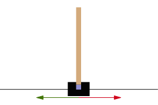
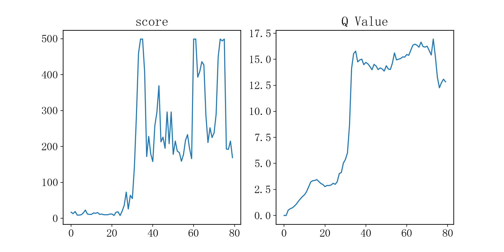
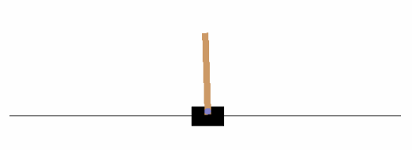
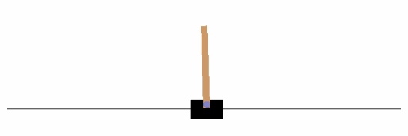

# 强化学习

强化学习（Reinforcement Learning, RL）是一种通过不断试错，并从中不断改进从而提升效果的学习算法.

一般来说，游戏或电脑中模拟的现实情况称为**环境**（Environment)，**智能体**（Agent）在环境中可以做出**行动**（Action）从而最大化累积**奖励**（Reward），在每次行动后，智能体可以通过**观察**（Observe）环境得到**状态**（State）的变化并获得当前行动的**奖励**. 这段过程可以随着时间序列反复进行，可以表示为下图的Markov链形式：

我们通过初始化环境 $s_0$ 开始，对于每一次迭代，智能体会观察当前的状态 $s_t$，通过预测算法，执行最好的行动 $a_t$. 随后环境会返回当前行动对应的奖励 $r_t$ 和一个新的状态 $s_{t+1}$，并且可以得到当前游戏是否已经结束. 上述过程可以反复执行，直到游戏结束.

## Deep Q-Learning Network (DQN)

DQN算法那原文连接：[2013版(arxiv)](https://arxiv.org/abs/1312.5602) [2015版(nature)](http://www.nature.com/nature/journal/v518/n7540/abs/nature14236.html)，下面开始详细介绍DQN算法. 

### 基本概念

设环境状态空间维数为 $N$，行为空间维数为 $M$. 在第 $t$ 时刻的状态记为 $s_t$，做出的行动为 $a_t$，得到的奖励为 $r_t$，其中 $t\in\mathbb{N}, s_t\in \mathbb{R}^N, a_t\in\mathbb{R}^M, r_i\in\mathbb{R}$.

#### 1. 策略Policy

策略 $\pi$ 指的是智能体的行动函数 $\pi(s): \mathbb{R}^N\to \mathbb{R}^M$，从状态空间映射到行动空间，表示在 $s$ 状态下，智能体做出的行动. 强化学习中有两种Policy，分别是确定性策略（Deterministic policy）和不确定性策略（Stochastic policy），前者根据状态，给出确定的行动，而后者给出每个行动的概率.

#### 2. 阶段Episode

一个阶段指的是：游戏从开始到结束的过程，结束时刻可以是游戏终止或者是到达时间上限. 一个阶段由每个时刻下的状态，行为，奖励构成：
$$
(s_1, a_1, r_1, s_2, a_2, r_2, \cdots, s_{T-1}, a_{T-1}, r_{T-1}, s_T), \quad T\in\mathbb{N}
$$

#### 3. 回报函数Return Function

又称累积折扣奖励（Cumulative Discounted Reward），定义在 $t_0$ 时刻下的return为：
$$
G_{t_0} = \sum_{t=t_0}^\infty\gamma^{t-t_0}r_t=r_t+\gamma r_{t+1}+\gamma^2 r_{t+2}+\cdots
$$
其中 $\gamma\in(0,1]$ 表示折扣因子（Discount Factor），在训练前固定的常数. 上述公式类似于金融中的贴现金额，$\gamma$ 类似于贴现因子，相同价值的物品，随着时间越久，其相对价值会随之降低.

当 $\gamma\in (0, 1]$ 时，$G_{t}$ 为累积奖励函数，智能体的学习目标就是最大化累积奖励的期望，即下文的值函数.

#### 4. 值函数Value Function

值函数分为两种：

第一种称为**状态值函数**， $V_\pi(s): \mathbb{R}^N\to\mathbb{R}$，定义为
$$
V_\pi(s_t) = \mathbf{E}_\pi(G_t|S=s_t)
$$
上式表明从 $t$ 时刻的状态 $s_t$ 开始，遵循策略 $\pi$ 时的回报函数 $G_t$ 的期望值.

第二种称为**状态行动值函数**，$Q_\pi(s_t, a_t):\mathbb{R}^{N+M}\to \mathbb{R}$，定义为
$$
Q_\pi(s_t,a_t) = \mathbf{E}_\pi(G_t|S=s_t, A=a_t)
$$

上式表示从 $t$ 时刻的状态 $s_t$ 开始采取行动 $a_t$ 遵循策略 $\pi$ 时回报函数 $G_t$ 的期望值，与第一种值函数的区别在于多确定了一步的行动 $a_t$. **用神经网络对值函数 $Q_\pi(s_t, a_t)$ 进行近似是DQN的核心思路.**

强化学习是一个反复重复上述迭代的过程，在每次迭代时，需要解决两个问题：通过值函数更新策略，和根据策略更新值函数.

### Q-Learning

首先弄清楚Q-Learning算法原理，假设我们不清楚具体策略 $\pi$ 是什么，通过随机给定的一个函数 $Q(s, a)$ 去近似 $Q_\pi(s,a)$，考虑之前梯度下降算法的思路，通过求偏导可以得到学习参数的下降方向，类似的，这里也要找到 $Q(s,a)$ 合理的下降方向. 通过变化 $Q_\pi(s_t,a_t)$ 的定义式我们可以发现有意思的结论，当 $t+1$ 时刻不是终止时刻时：
$$
\begin{align*}
Q_\pi(s_t, a_t) =&\ \mathbf{E}_\pi(G_t|S=s_t, A=a_t)\\
=&\ \mathbf{E}_\pi(r_t+\gamma G_{t+1}|S=s_t, A=a_t)\\
=&\ r_t+\gamma E_\pi(G_{t+1}|S=s_t,A=a_t)\\
=&\ r_t + \gamma E_\pi(G_{t+1}|S=s_{t+1})\\
=&\ r_t + \gamma \max_{a'\in \mathbb{R}^M}E_\pi(G_{t+1}|S=s_{t+1}, A=a')\\
=&\ r_t+\gamma \max_{a'\in\mathbb{R}^M}Q_\pi(s_{t+1}, a')
\end{align*}
$$
其中 $r_t, s_{t+1}$ 分别为 $s_t$ 状态下执行行动 $a_t$ 所得到的奖励和新的状态. 当 $t+1$ 时刻是终止时刻时，则 $Q_\pi(s_t,a_t) = r_t$.

于是我们得到了 $Q(s_t, a_t)$ 的更新目标：当 $t+1$ 不是终止时刻时，$y_t=\displaystyle r_t+\gamma \max_{a'\in\mathbb{R}^M}Q(s_{t+1},a')$ ，当 $t+1$ 是终止时刻时，$y_t=r_t$. 记下降方向 $\boldsymbol{d} = y_t - Q(s_t, a_t) $ ，则更新公式为

$$
Q(s_t,a_t)\leftarrow Q(s_t, a_t) + \alpha\boldsymbol{d}
$$

其中 $\alpha\in(0,1)$，称为学习因子或步长.

### DQN

DQN其实就是Q-Learning的变体，将值函数用神经网络去近似. 设神经网络函数为 $Q(s, a;\omega)$，其中 $\omega$ 为该网络的权值. 则损失函数为
$$
\mathcal{L}(s_t, a_t, y_t;\omega) = (y_t - Q(s_t, a_t;\omega)) ^ 2, \\
\text{其中 }y_t=
\begin{cases}
r_t,&\quad t+1\text{步为终止时刻},\\
r_t+\gamma\max_{a\in \mathbb{R}^M}Q(s_{t+1},a;\omega),&\quad \text{否则}.
\end{cases}
$$
和原来的神经网络训练问题比较，这里的 $s_t, a_t$ 可以视为输入特征，$y_t$ 为对应的标签. 在一般的神经网络中，标签一般是固定的，而在这个训练问题中，标签与当前的神经网络相关，可能导致算法不收敛. 于是有一种方法是，在创建一个网络结构与 $Q$ 一模一样的神经网络，但只有参数值更新速度比 $Q$ 慢，称为**目标神经网络**，用于生成 $y_t$. 我们记目标神经网络的参数为 $\omega^-$，当前神经网络的参数为 $\omega$. 则损失函数为
$$
\mathcal{L}(s_t, a_t, y_t;\omega) = (y_t - Q(s_t, a_t;\omega)) ^ 2, \\
\text{其中 }y_t=
\begin{cases}
r_t,&\quad t+1\text{步为终止时刻},\\
r_t+\gamma\max_{a\in \mathbb{R}^M}Q(s_{t+1},a;\omega^-),&\quad \text{否则}.
\end{cases}
$$
区别只在 $y_t$ 的计算来源发生了变化. 在2013年发表的论文中没有使用目标神经网络，而2015年发表的论文中才提出目标神经网络.

### $\varepsilon-greedy$ 策略

$greedy$ 策略指的就是贪心策略，其每次选取的均为值函数最大的行动，即 $a_t = \mathop{\mathrm{argmax}}\limits_{a\in \mathbb{R}^M}{Q(s_t,a;\omega)}.$. 但是这样会导致对于采样中没有出现过的 $(s, a)$，由于没有 $Q$ 值，之后可能就不会被采样到.

这里与强化学习中的重要概念相关，叫探索与利用（Exploration & Exploitation）. 前者强调发现环境中的更多信息，不仅局限于已知的信息中；后者强调从已知的信息中最大化奖励. 而 $greedy$ 策略只注重了后者，而没涉及到前者.

而 $\varepsilon-greedy$ 策略则是以 $\varepsilon$ 的概率从行动空间中随机返回一个行动，以 $1-\varepsilon$ 的概率选择贪心策略，这样就能更具有随机性. $\varepsilon$ 可以随时间的增长而下降，例如 $\varepsilon = \delta^t,\ \delta\in (0,1)$.

## Cartpole问题

Cartpole问题可以视为一个[倒立摆问题](https://baike.baidu.com/item/%E5%80%92%E7%AB%8B%E6%91%86/7765096)，倒立摆是一个重心高于其[枢轴](https://baike.baidu.com/item/%E6%9E%A2%E8%BD%B4/2010044)点的摆. 它是不稳定的，但是可以通过移动枢轴点位置以保持该系统的稳定性. 我们的目标是尽可能长地保持摆的垂直状态.

- 紫色方块代表枢纽点.
- 红色和绿色箭头分别表示枢纽点可移动的水平方向.

> 一个摆通过一个无摩擦的枢轴连接到推车上，该推车沿着水平方向的无摩擦轨道移动. 通过对推车施加 $+1$ 和 $-1$ 的推力来维持该系统平衡，保持摆的直立状态. 当杆在一个时间戳保持直立，则获得 $+1$ 的奖励. 当杆与竖直方向的夹角超过 $15^\circ$，或者小车相对中心的移动距离超过 $2.4$ 个单位时，游戏结束.

### 代码实现

完整代码及解释：[Cartpole 完整模块](https://github.com/wty-yy/DeepLearing-Summer/tree/master/MIT%206S191/Lab3). 此部分代码使用的是模块式写法，包含以下4个模块

1. `run.py` 为主程序，用于实例化模块，调用训练函数、测试训练效果.
2. `cartpole.py` 为环境操作及过程性数据保存代码，包含环境创建、预测模型创建、与环境进行交互、获取环境状态、调用模型进行训练、保存训练结果、测试模型效果等功能.
3. `dqn.py` 为智能体的代码，包含创建神经网络、预测下一步的行动、通过记忆回溯对参数进行训练等功能.
4. `constant.py` 保存所有代码中使用到的常量，包含神经网络所用的超参数、最大训练步数、保存文件的目录等.

可以通过查看 `training_checkpoints` 文件夹下的图片实时查看训练效果，每次重复开始 $80$ 次游戏，完成全部训练在 $30$ 分钟左右，游戏最大时长为 $500$ 帧，我们的模型平均在重复 $30$ 次游戏时就能达到游戏最大时长，训练时间在 $15$ 分钟左右. 下图是某次训练的效果曲线，`score` 表示该模型游戏时长（帧），`Q Value` 为预测模型对 $Q$ 值进行的预测结果.

以下是两个模型训练结果的动图.

## 参考资料：

1. [Wanjun's blog - 强化学习—DQN算法原理详解](https://wanjun0511.github.io/2017/11/05/DQN/#more).

   代码参考：

2. [Cartpole - Introduction to Reinforcement Learning (DQN - Deep Q-Learning)](https://gsurma.medium.com/cartpole-introduction-to-reinforcement-learning-ed0eb5b58288#:~:text=A%20pole%20is%20attached%20by%20an%20%EE%80%80un-actuated%20joint%EE%80%81,for%20every%20timestep%20that%20the%20pole%20remains%20upright.).

3. [PyLessons - Introduction to Reinforcement Learning](https://pylessons.com/CartPole-reinforcement-learning).

